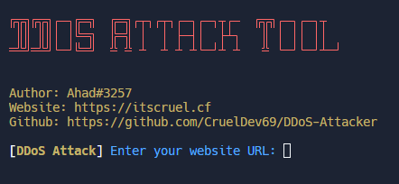
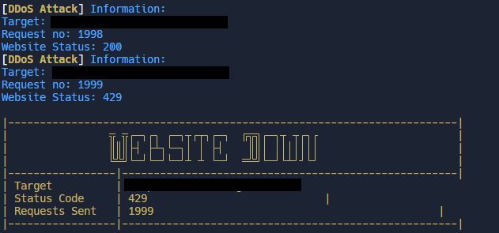

# DDoS-Attacker
A DDoS Attack Tool (for websites only) Made With ❤ By Ahad#3257

This Repository was inspired by **__[Shahzain345](https://github.com/shahzain345)__**

# How To Use?
It's very simple just follow the steps written below.

Type `pip install -r requirements` to install all required modules.

Run `DDos.py` by typing `py DDoS.py` in your terminal

Enter a website URL and wait for it to get down by this tool.

**__Recommendation__**: Try running it on Replit or make sure you turn on your VPN when running this script on your PC.

# FAQs

***

| Question          | Answer                                                                                    |
|-----------------------|------------------------------------------------------------------------------------------------|
| **Can we DDoS a IP by using this code?**         | No you can only DDoS a website using this script.                      |
| **How will we turn it off when targeted website is down?**         | You don't have to worry about it because when website status code changes to 429 it will automatically quit.                                            |
| **How many request it can send maximum?**            | It will send requests until targeted website returns statuc code 429.                                |
                                                                           

***

***
# Note:
Use it but please give credits to author.

Skidding this code is not allowed if you see anyone taking credits of this script dm me on discord.

# Social Media:
[Instagram](https://www.instagram.com/ahadnoor._) ・
[Discord](https://discord.gg/Ncsc5pRNgf) ・
[Website](https://www.itscruel.cf/) 

# Discord: Ahad#3257
If you liked this repo please don't forget to give it a star it would mean a lot.